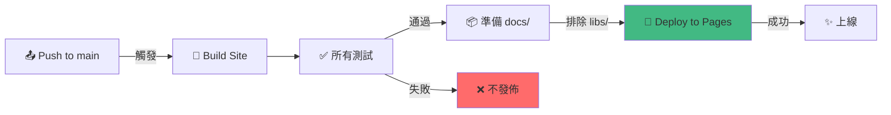

# GitHub Pages 配置步驟

## 概述

本專案已配置為 GitHub Pages 部署，具有以下特點：

- **前端代碼**（HTML/CSS/JS）：自動部署到 GitHub Pages
- **遊戲映像**（WebAssembly/mudlib.data.gz）：本地加載，不上傳 GitHub
- **優勢**：GitHub Pages 訪問快速，WebAssembly 映像保留在本地

## 配置步驟

### 1. 在 GitHub 倉庫設置中啟用 GitHub Pages

進入倉庫的 **Settings** > **Pages**

| 設定項 | 值 |
|---|---|
| **Source** | Deploy from a branch |
| **Branch** | `main` |
| **Folder** | `/docs` |


### 2. 確認部署狀態

1. 進入 **Actions** 標籤
2. 找到 `Pages` workflow
3. 確認最新的 run 狀態為 ✅ **Passed**

### 3. 訪問線上版本

部署完成後，訪問：
```
https://szupotseng.github.io/zjmud-rust/
```

## 部署流程

每次 push 到 `main` 分支時：



## 本地開發

### 方案 A：本地伺服器（推薦）

```bash
npm start
```

訪問 `http://localhost:3000`，同時供應前端與本地 libs/。

### 方案 B：靜態文件

```bash
# 建置
cd webclient
npm ci
npm run build

# 用瀏覽器開啟
open ../docs/index.html
```

注意：某些瀏覽器因 CORS 限制無法直接訪問本地 libs/。

### 方案 C：與 GitHub Pages 混合

GitHub Pages 提供前端：
```
https://szupotseng.github.io/zjmud-rust/
```

本地提供 libs/（需配置前端的 `libsPath` 環境變數）。

## 文件結構

### GitHub Pages 上傳的部分（docs/）
```
docs/
├── index.html           ← 首頁
├── js/                  ← JavaScript 客戶端
├── css/                 ← 樣式表
├── _driver/             ← FluffOS WebAssembly driver
└── libs/
    └── index.json       ← 遊戲清單（無映像數據）
```

### 本地保留的部分（libs/）- **不上傳 GitHub**
```
libs/
├── 91shujian/mudlib.data.gz
├── aoxiangtianji/mudlib.data.gz
├── ...
└── （209 個遊戲映像）
```

總計：
- **docs/** 上傳大小：~200 MB
- **libs/** 本地大小：~4.5 GB

## 故障排除

### ❌ Pages 部署失敗

1. 檢查 **Actions** 標籤的錯誤日誌
2. 常見原因：
   - 測試失敗（紅燈自動擋發佈）
   - 隱私掃描有命中（密碼洩漏）
   - 憑證檢查失敗

### ❌ Pages 頁面顯示 404

1. 確認 Settings > Pages 中 Branch 設為 `main`，Folder 設為 `/docs`
2. 檢查是否已上傳 artifact（Actions > 最新 run > 下載區）

### ⚠️ 新遊戲沒有出現在清單中

1. 確認 `libs/<slug>/mud.json` 存在
2. 檢查 `prepare-pages.mjs` 是否成功生成 `docs/libs/index.json`
3. 清快取（Ctrl+Shift+R）

## 自動部署工作流

| 步驟 | 用途 | 失敗時 |
|---|---|---|
| 1. 客戶端測試 | 確保 UI 無誤 | ❌ 不部署 |
| 2. 憑證掃描 | 防洩漏密碼 | ❌ 不部署 |
| 3. 映像健檢 | 驗證 .gz 與 mudlib.json | ❌ 不部署 |
| 4. 建站 | 生成 site/ | ❌ 不部署 |
| 5. 全鏈路驗證 | 真 WASM + 真 DOM + 真 HTTP | ⚠️ 警告（照樣部署） |
| 6. 建角測試 | 命名規則（簡繁 × 長度） | ⚠️ 警告（照樣部署） |
| 7. 真網頁驗證 | 瀏覽器路徑（選單 → 登入 → 建角） | ⚠️ 警告（照樣部署） |
| 8. 版面檢查 | 真 Chromium 多視口 | ⚠️ 警告（照樣部署） |
| 9. 目錄頁驗證 | 搜尋/篩選功能 | ✅ 照樣部署 |
| 10. Driver log | 蒐集每台的例外 | ✅ 照樣部署（僅記錄） |
| 11. 分級檢查 | 驗證 badge 正確性 | ✅ 照樣部署 |
| 12. 準備 Pages | 複製到 docs/（排除 libs/） | ❌ 不部署 |
| 13. 部署 | 推送到 GitHub Pages | ❌ 不部署 |

## 環境變數

構建過程中可用的環境變數（見 `webclient/tools/build-site.mjs`）：

```bash
# 只建置特定遊戲（逗號分隔）
--only 91shujian,huoying

# 跳過開機測試（CI 預設開啟以節省時間）
--skip-boot-test

# 保留 libs/ 在原處（不複製進 site/）
--link-libs
```

## 相關連結

- [GitHub Pages 文件](https://docs.github.com/en/pages)
- [GitHub Actions 工作流](../.github/workflows/pages.yml)
- [站台建置指令](../webclient/tools/build-site.mjs)
- [本地開發伺服器](../webclient/tools/serve-site.mjs)
